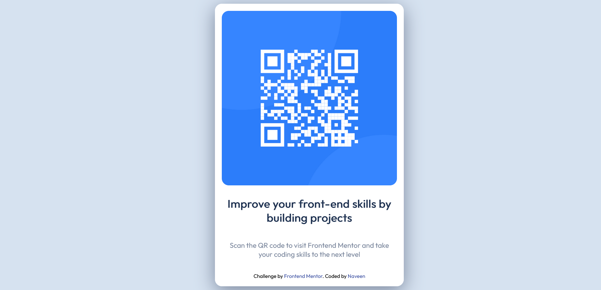

# Frontend Mentor - QR code component solution

This is a solution to the [QR code component challenge on Frontend Mentor](https://www.frontendmentor.io/challenges/qr-code-component-iux_sIO_H). Frontend Mentor challenges help you improve your coding skills by building realistic projects. 

## Table of contents

- [Overview](#overview)
  - [Screenshot](#screenshot)
  - [Links](#links)
- [My process](#my-process)
  - [Built with](#built-with)
  - [Useful resources](#useful-resources)
- [Author](#author)
- [Acknowledgments](#acknowledgments)

## Overview

### Screenshot

### Links

- Solution URL: [https://github.com/NaveenGali11/Frontend-masters-qr-question](https://github.com/NaveenGali11/Frontend-masters-qr-question)
- Live Site URL: [https://naveengali11.github.io/Frontend-masters-qr-question/](https://naveengali11.github.io/Frontend-masters-qr-question/)

### Built with

- Semantic HTML5 markup
- CSS custom properties
- Flexbox
- CSS Grid

### Useful resources

- [W3 Schools Html](https://www.w3schools.com/html/default.asp) - This helped me for taking a glimpse on the html tags. I really liked this pattern and will use it going forward.
- [W3 Schools Css](https://www.w3schools.com/css/default.asp) - This helped me for taking a glimpse on the css like getting the background of the pages. I really liked this pattern and will use it going forward.

## Author

- Website - [Naveen Gali](https://naveengali11.github.io/)
- Frontend Mentor - [@NaveenGali11](https://www.frontendmentor.io/profile/NaveenGali11)
- Twitter - [@Naveengali5](https://www.twitter.com/Naveengali5)
